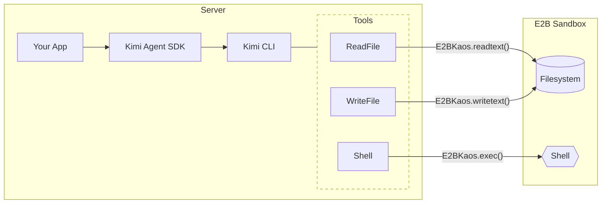

# Example: E2B Sandbox

This example demonstrates how to run Kimi Agent in an [E2B](https://e2b.dev) cloud sandbox using **KAOS** (Kimi Agent Operating System).

## What is KAOS?

**KAOS** is a runtime abstraction layer that decouples agent tools from the underlying execution environment. It defines a standard interface for file system operations, process execution, and path manipulation—allowing the same agent code to run locally or in a cloud sandbox.



By default, tools operate on your local filesystem. With `set_current_kaos(E2BKaos(...))`, all tool calls are transparently routed to the E2B sandbox—no agent code changes required.

## How It Works

This example vendors an `E2BKaos` implementation in `e2b_kaos.py`, then installs it via `set_current_kaos` so Kimi CLI tools operate on the E2B sandbox environment:

```python
from e2b import AsyncSandbox
from kaos import set_current_kaos
from kaos.path import KaosPath
from kimi_agent_sdk import prompt

# Create an E2B sandbox and install as KAOS backend
sandbox = await AsyncSandbox.create()
set_current_kaos(E2BKaos(sandbox, cwd="/home/user"))

# Agent tools now operate inside the sandbox
async for msg in prompt("Create a Python project", work_dir=KaosPath("/home/user")):
    print(msg.extract_text(), end="")
```

## Run

```sh
cd examples/python/e2b-sandbox
uv sync --reinstall

# Required
export KIMI_API_KEY=your-api-key
export KIMI_BASE_URL=https://api.moonshot.ai/v1
export KIMI_MODEL_NAME=kimi-k2-thinking-turbo
export E2B_API_KEY=your-e2b-api-key

# Optional
export E2B_SANDBOX_ID=...
export KIMI_WORK_DIR=/home/user/kimi-workdir

uv run main.py
```

If `E2B_SANDBOX_ID` is not set, the script creates a sandbox and prints the ID. The sandbox lifecycle is managed outside of the SDK.
