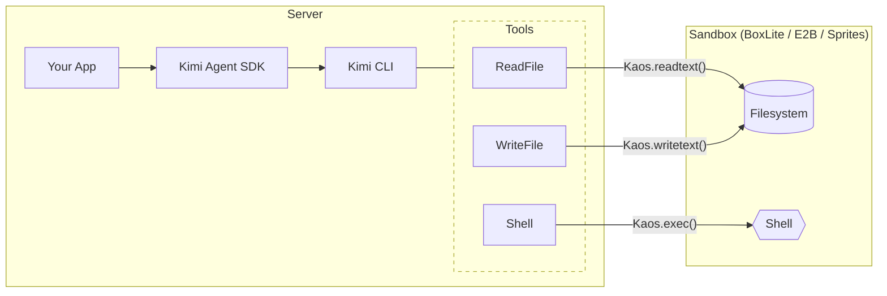

# KAOS Sandbox Examples

**KAOS** (Kimi Agent Operating System) is a runtime abstraction layer that decouples agent tools from the underlying execution environment. It defines a standard interface for file system operations, process execution, and path manipulation — allowing the same agent code to run locally or inside any supported sandbox.

This directory contains three ready-to-run backends that demonstrate the pattern:

| Backend | Environment | Description |
| --- | --- | --- |
| [boxlite/](./boxlite/) | Local container | Runs tools inside a BoxLite box on your machine |
| [e2b/](./e2b/) | Cloud sandbox | Runs tools inside an [E2B](https://e2b.dev) remote sandbox |
| [sprites/](./sprites/) | Cloud sandbox | Runs tools inside a [Sprites](https://sprites.dev) persistent environment |

## How It Works

All three backends follow the same four-step pattern:

1. **Create or connect** to a sandbox resource (box / sandbox / sprite)
2. **Install** the backend via `set_current_kaos(...)`
3. **Call** `prompt(...)` or `Session` — tools are transparently routed to the sandbox
4. **Reset** KAOS context and clean up resources

> **Note:** The `Grep` tool currently only supports local KAOS, so all sandbox examples disable it in their `agent.yaml`.
